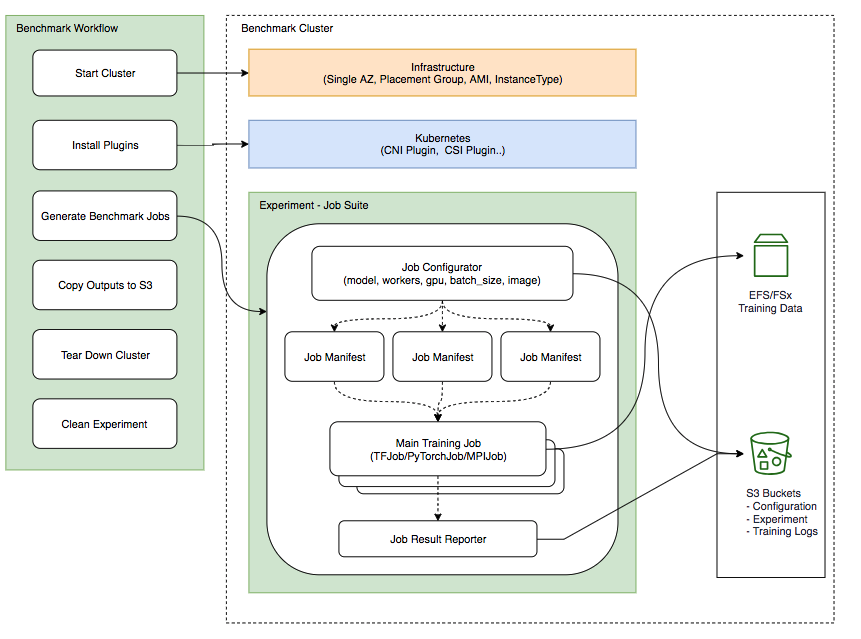
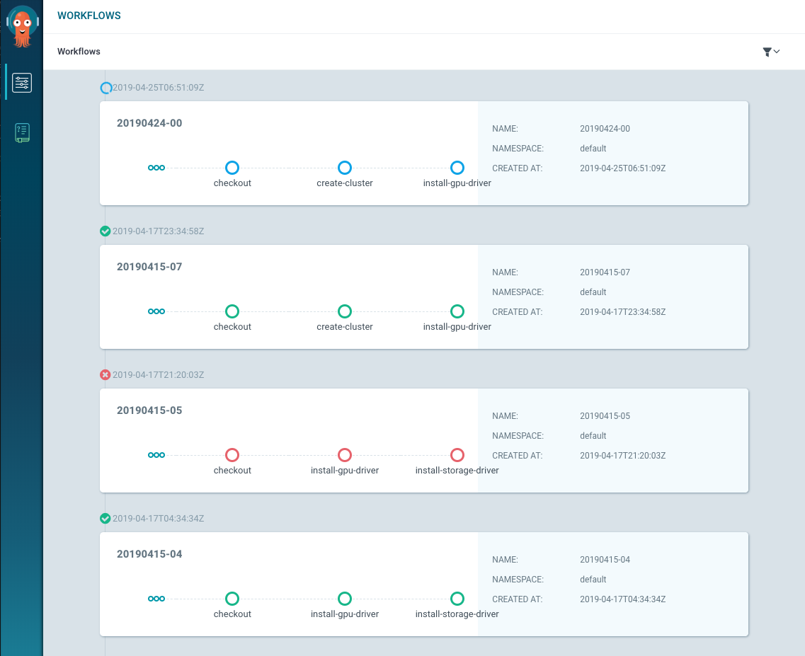
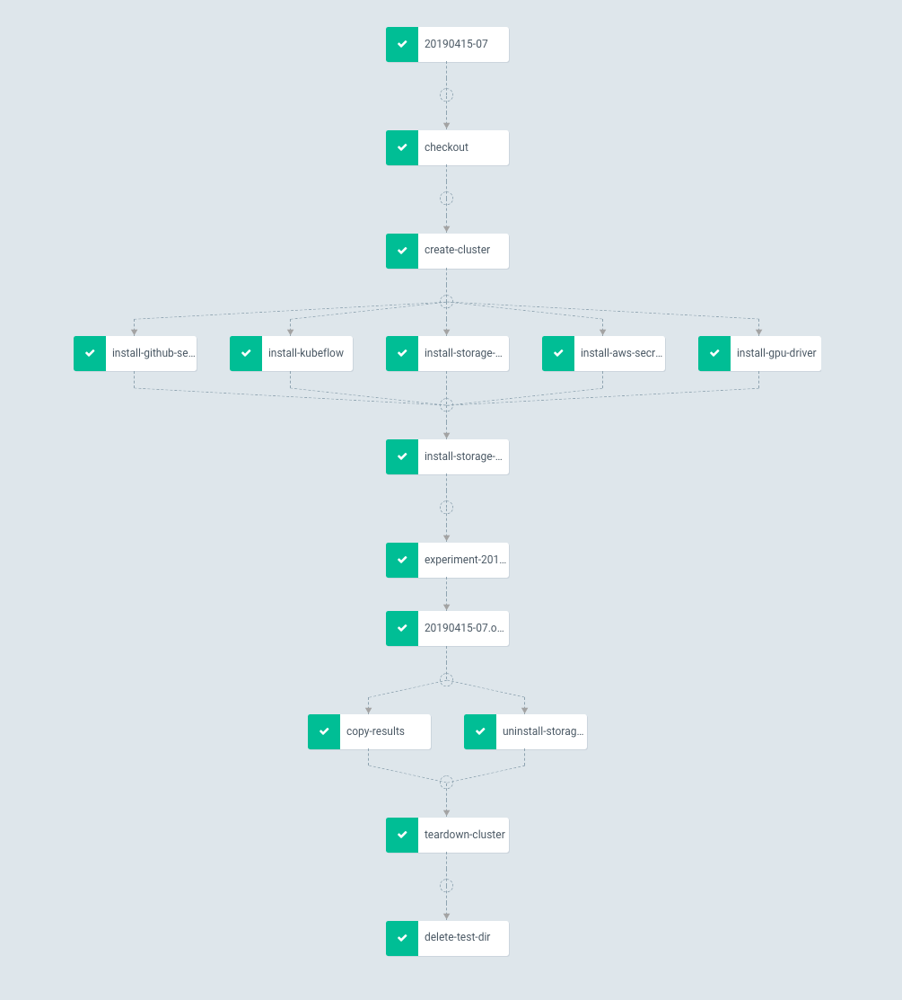

# AWS EKS Deep Learning Benchmarking Utility
The AWS EKS Deep Learning Benchmarking Utility is a fully automated tool to run machine learning benchmarks on Kubernetes clusters.

## Features
* Fully automated end-to-end benchmarking workflow from cluster creation to cluster tear down
* Highly configurable Kubernetes cluster configurations
* Supports different backend storage including [Amazon Elastic File System](https://aws.amazon.com/efs/) and [Amazon FSx for Lustre](https://aws.amazon.com/fsx/lustre/)
* Uses S3 to read benchmark configs and write back experiment results
* Backed by [kubeflow](https://github.com/kubeflow/kubeflow) operators and [kubebench](https://github.com/kubeflow/kubebench). Supports multiple frameworks including:
  * Tensorflow
  * Tensorflow + Horovod + OpenMPI
  * PyTorch
  * MxNet
* Exit handlers to copy immediate results and automatically tear down cluster
* Run multiple experiments in parallel

### High Level Design



## Prerequisite to run benchmarks
To successfully run benchmarks automatically, you need to:
1. [Setup NFS](#setup-nfs)
2. [Install Argo Workflow](#install-argo-workflow)
3. [Configure AWS credentials](#setup-aws-credentials)
4. [Configure your GitHub token](#setup-github-token)
5. [Setup S3 buckets for your benchmark results and (optional) your training data](#setup-s3-buckets)
6. [Configure your Kubernetes cluster]((#cluster-configuration))

### Setup NFS
Each benchmark has many steps and needs a file system to sync its status. We setup a NFS to store benchmark configuration, required source files, and benchmark results. All files will be synced to the S3 bucket after the experiment completes.

> Note: This is not a real NFS, it's actually a website frontend server emulate as NFS. Please check [source](https://github.com/kubernetes/examples/tree/master/staging/volumes/nfs) for details.

```bash
kubectl create -f deploy/benchmark-nfs-svc.yaml
kubectl get svc benchmark-nfs-svc -o=jsonpath={.spec.clusterIP}

# Replace ip in the `deploy/benchmark-nfs-volume.yaml` before following step
kubectl create -f deploy/benchmark-nfs-volume.yaml
```

### Install Argo workflow
Argo Workflows is an open source container-native workflow engine for orchestrating parallel jobs on Kubernetes. Each benchmark experiment is an argo workflow and we use this to orchestrate and manage our jobs.

```bash
kubectl create ns argo
kubectl apply -n argo -f https://raw.githubusercontent.com/argoproj/argo/v2.2.1/manifests/install.yaml

# you can forward port to localhost and look at Argo UI
kubectl port-forward deployment/argo-ui 8001:8001 -n argo
```

### Setup AWS Credentials
Replace `YOUR_AWS_ACCESS_KEY_ID` and `YOUR_AWS_SECRET_ACCESS_KEY` with your own aws credentials.
This account needs to have at least following permissions. It will be used in the experiment to create EKS cluster, setup data storage like EFS or FSx for Lustre, write to S3 buckets.

```bash
kubectl apply -f deploy/aws-secret.yaml
```

### Setup Github Token
Replace `YOUR_GITHUB_TOKEN` with your github token. Github token is used with ksonnet otherwise the experiment will quickly runs into GitHub API limits.

```bash
kubectl apply -f deploy/github-token.yaml
```

### Setup S3 buckets
Firstly, please create a bucket for benchmark results. `copy-result` step will sync results to bucket `s3ResultBucket` specified in your configuration.

If you like to use real storage for testing, Please create another S3 bucket and upload your training files there. Please set `s3DatasetBucket` and `storageBackend` in the configuration and workflow will automatically create backend storage like [Amazon Elastic File System](https://aws.amazon.com/efs/) or [Amazon FSx For Lustre](https://aws.amazon.com/fsx/lustre/) and sync files in `s3DatasetBucket` to the storage. During training, storage will be mounted as [Persistent Volume](https://kubernetes.io/docs/concepts/storage/persistent-volumes/) to worker pods.


### Cluster configuration

Kubernetes & Worker Node:
- clusterConfig: 's3://kubeflow-pipeline-data/benchmark/cluster_config.yaml'

Cluster configuration example
```yaml
# For details, Please check eksctl documentation or API specs.
# https://github.com/weaveworks/eksctl/blob/master/pkg/apis/eksctl.io/v1alpha4/types.go

apiVersion: eksctl.io/v1alpha4
kind: ClusterConfig
metadata:
  name: YOUR_EKS_CLUSTER_NAME
  region: us-west-2
  version: '1.12'
# If your region has multiple availability zones, you can specify 3 of them.
availabilityZones: ["us-west-2a", "us-west-2b", "us-west-2c"]

# NodeGroup holds all configuration attributes that are specific to a nodegroup
# You can have several node group in your cluster.
nodeGroups:
  - name: training
    instanceType: p3.16xlarge
    desiredCapacity: 1
    minSize: 0
    maxSize: 2
    volumeSize: 30
    availabilityZones: ["us-west-2a"]
    iam:
      withAddonPolicies:
        efs: true
        fsx: true
    # Node Group AMI Id
    # ami: xxxxx
```

Training model:
- storageBackend: 'fsx' | 'efs'
- s3DatasetPath: 's3://eks-dl-benchmark/imagenet/'
- s3ResultPath: ''s3://eks-dl-benchmark/benchmark/'
- experiments:
    - experiment: 'experiment-20190424-gpu-16',
    - trainingJobConfig: 's3://kubeflow-pipeline-data/benchmark/mpi-job-imagenet.yaml',
    - trainingJobPkg: 'mpi-job',
    - trainingJobPrototype: 'mpi-job-custom',
    - trainingJobRegistry: 'github.com/jeffwan/kubeflow/tree/make_kubebench_reporter_optional/kubeflow

Training job configuration:
```yaml
args: --batch_size=256,--model=resnet50,--num_batches=100,--fp16,--display_every=50,--lr_decay_mode=poly,--intra_op_parallelism_threads=2,--inter_op_parallelism_threads=8,--num_parallel_calls=8,--data_dir=data_dir=/kubebench/data/imagenet/train
command: mpirun,-mca,btl_tcp_if_exclude,lo,-mca,pml,ob1,-mca,btl,^openib,--bind-to,none,-map-by,slot,-x,LD_LIBRARY_PATH,-x,PATH,-x,NCCL_DEBUG=INFO,-x,NCCL_MIN_NRINGS=4,-x,HOROVOD_FUSION_THRESHOLD=16777216,-x,HOROVOD_HIERARCHICAL_ALLREDUCE=1,python,models/resnet/tensorflow/train_imagenet_resnet_hvd.py
gpusPerReplica: 1
image: seedjeffwan/eks-dl-benchmark:cuda10-tf1.13.1-hvd0.16.0-py3.5
name: resnset-aws-imagenet
replicas: 1

```


## Run the benchmmark jobs

You have two ways to configure your benchmark jobs.

1. Update your workflow setting using `ks` command

  ```bash
  ks param set workflows storageBackend fsx
  ```

2. Update benchmark workflow manifest directly
  ```
  vim ks-app/components/params.libsonnet
  ```

Here's an example of full configurations in `ks-app/components/params.libsonnet`:

```yaml
s3ResultPath: 's3://kubeflow-pipeline-data/benchmark/',
s3DatasetPath: 's3://eks-dl-benchmark/imagenet/',
clusterConfig: 's3://kubeflow-pipeline-data/benchmark/cluster_config.yaml',
experiments: [{
  experiment: 'experiment-20190415-01',
  trainingJobConfig: 's3://kubeflow-pipeline-data/benchmark/mpi-job-imagenet.yaml',
  trainingJobPkg: 'mpi-job',
  trainingJobPrototype: 'mpi-job-custom',
  // Change to upstream once https://github.com/kubeflow/kubeflow/pull/3062 is merged
  trainingJobRegistry: 'github.com/jeffwan/kubeflow/tree/make_kubebench_reporter_optional/kubeflow',
}],
githubSecretName: 'github-token',
githubSecretTokenKeyName: 'GITHUB_TOKEN',
image: 'seedjeffwan/benchmark-runner:20190424',
name: '20190424-00',
namespace: 'default',
nfsVolume: 'benchmark-pv',
nfsVolumeClaim: 'benchmark-pvc',
region: 'us-west-2',
trainingDatasetVolume: 'dataset-claim',
s3SecretName: 'aws-secret',
s3SecretAccesskeyidKeyName: 'AWS_ACCESS_KEY_ID',
s3SecretSecretaccesskeyKeyName: 'AWS_SECRET_ACCESS_KEY',
storageBackend: 'fsx',
kubeflowRegistry: 'github.com/jeffwan/kubeflow/tree/make_kubebench_reporter_optional/kubeflow'
```

For `clusterConfig` and `trainingJobConfig`, please check [config](./config) for example. Be sure to change the `name` value for every benchmark.

Once you are done, you can run `ks show default -c workflows > workflow.yaml`. If your input is valid, you will see workflow.yaml in your folder.

This is an argo workflow and you can easily submit to your cluster by `kubectl apply -f workflow.yaml`.

### Benchmark Workflow






### Experiment Outputs
Experiment outputs will sync to S3 after experiment done. You can check configuration of your cluster, storage and experiments. The most important thing is training logs and metrics, you can find it under `experiments/${experiment_id}/{Launch_pod}`

```
├── eksctl-cluster-config.yaml
├── storage-config.yaml
├── experiments
│   └── mpi-job-imagenet-201904251700-sszd
│       ├── config
│       │   ├── kf-job-manifest.yaml
│       │   └── mpi-job-imagenet.yaml
│       └── output
│           └── mpi-job-imagenet-201904251700-sszd-launcher-6b69v (training logs)
├── ks-app
├── kubeconfig
└── logs
    └── start_cluster.log

```

## Contributing Guidance

### Test Python module locally
```
export PYTHONPATH=${YOUR_PATH_TO}/kubeflow/testing/py:{YOUR_PATH_TO}/aws-eks-deep-learning-benchmark/src

python -m benchmark.test.install_storage_backend --storage_backend=fsx --experiment_id=001 --s3_import_path=s3://eks-dl-benchmark
```

## Acknowledgements

Thanks [Xinyuan Huang](https://github.com/xyhuang) from Cisco AI team for the help and support on kubebench integration. We also want to ackownledge Kubeflow community and we reuse some of logics and utils of [Test infrastructure and tooling for Kubeflow](https://github.com/kubeflow/testing).
